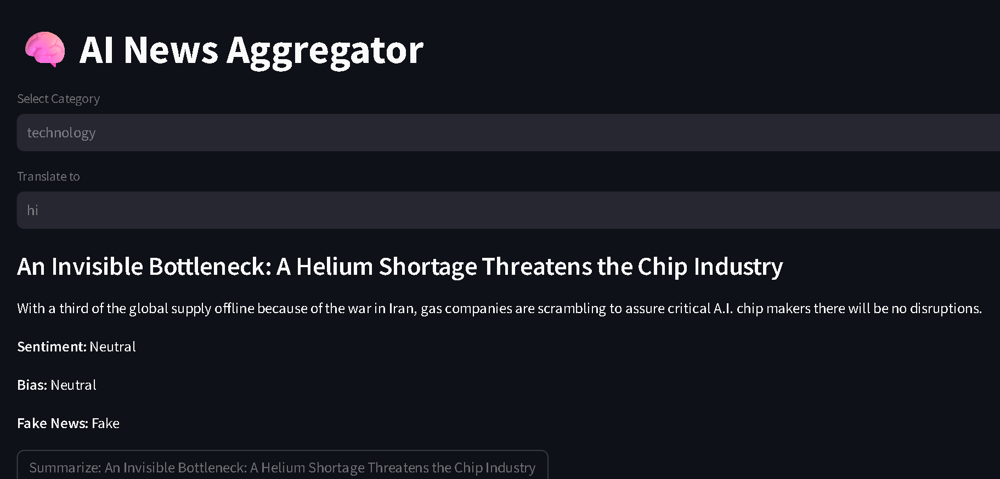

# 🧠 AI-Powered News Aggregator

An end-to-end AI-driven news aggregation platform that fetches real-time news and enhances it using Natural Language Processing (NLP) and Machine Learning techniques such as summarization, sentiment analysis, translation, text-to-speech, and fake news detection.
---

## 📌 Overview

This project is designed to solve information overload by delivering concise, intelligent, and accessible news content. It integrates multiple AI capabilities into a single unified application.

---

## ✨ Key Features

- 📰 **Real-Time News Fetching**  
  Fetches latest news using external APIs

- 🧠 **AI-Based Summarization**  
  Generates concise summaries using NLP models

- 😊 **Sentiment Analysis**  
  Classifies news into Positive / Negative / Neutral

- 🌍 **Multi-language Translation**  
  Translates news into multiple languages

- 🔊 **Text-to-Speech (TTS)**  
  Converts news into audio format

- 🚨 **Fake News Detection**  
  Uses a trained ML model to classify news authenticity

---

## 🏗️ Project Architecture

```

User Input → Streamlit UI → Services Layer → NLP/ML Models → Output Display

```

---

## 🛠️ Tech Stack

### 💻 Programming
- Python

### 🌐 Framework
- Streamlit

### 🧠 AI / ML / NLP
- TextBlob (Sentiment Analysis)
- Transformers (Summarization)
- Scikit-learn (Fake News Detection)

### 🔊 Utilities
- gTTS (Text-to-Speech)
- Deep Translator (Translation)

### 📡 APIs
- Mediastack / News API

---

## 📂 Project Structure

```

ai-news-aggregator/
│
├── app.py                      # Streamlit entry point
├── config.py                   # API keys, constants
│
├── services/                   # Core logic
│   ├── news_service.py         # Fetch news
│   ├── sentiment_service.py    # Sentiment analysis
│   ├── summarizer_service.py   # LLM summarization
│   ├── translation_service.py  # Language translation
│   ├── audio_service.py        # gTTS voice
│   ├── bias_detection.py       # Bias detection
│   ├── fake_news_model.py      # ML classifier
│
├── models/
│   ├── fake_news.pkl           # trained model
│
├── utils/
│   ├── helpers.py
│   ├── logger.py
│
├── data/
│   ├── dataset.csv             # fake news training data
│
├── requirements.txt
├── README.md
└── .env
└── .gitignore

````

---

## ⚙️ Installation & Setup

### 1️⃣ Clone Repository

```bash
git clone https://github.com/Chandru-debug1/ai-news-aggregator.git
cd ai-news-aggregator
````

### 2️⃣ Create Virtual Environment

```bash
python -m venv venv
venv\Scripts\activate   # Windows
```

### 3️⃣ Install Dependencies

```bash
pip install -r requirements.txt
```

### 4️⃣ Run Application

```bash
streamlit run app.py
```

---

## 📸 Screenshots

> Add your application screenshot below



---

## 📊 Machine Learning Details

* Model: Logistic Regression / Naive Bayes
* Vectorizer: TF-IDF
* Dataset: Fake News Dataset (Kaggle)
* Task: Binary Classification (Fake / Real)

---

## 🔐 Environment Variables

Create a `.env` file if using APIs:

```
OPENAI_API_KEY=your_api_key
NEWS_API_KEY=your_api_key
```

---

## 🚧 Future Enhancements

* 🔐 User Authentication System
* 🧠 Personalized News Recommendation (ML-based)
* 📱 Mobile Application
* ☁️ Cloud Deployment with CI/CD
* 📊 Dashboard Analytics

---

## 🧪 Testing

Basic testing can be done by running the app and verifying:

* API response correctness
* NLP outputs
* Model predictions

---

## 🤝 Contribution

Contributions are welcome. Please fork the repository and submit a pull request.

---

## 📄 License

This project is licensed under the MIT License.

---

## 👨‍💻 Author

**Chandru M**
B.Tech – Artificial Intelligence & Data Science

🔗 GitHub: [https://github.com/Chandru-debug1](https://github.com/Chandru-debug1)

---

## ⭐ Acknowledgements

* Open-source NLP libraries
* Kaggle datasets
* Streamlit community

```

---

# 🚀 What makes this “professional”

- Structured sections (Overview, Features, Architecture)  
- Technical depth (ML + NLP explained)  
- Clean formatting (recruiter-friendly)  
- Scalable design thinking (future improvements)  
- Deployment-ready  

---

# 🔥 Next Step (HIGH IMPACT)

Now do ONE thing:

👉 Add **Live Demo link + Screenshot**

Then say:

👉 **“upgrade this project to advanced level (FAANG ready)”**  

I’ll help you add:
- Recommendation system  
- User login  
- Real AI pipeline  
- Portfolio website 🚀
```
